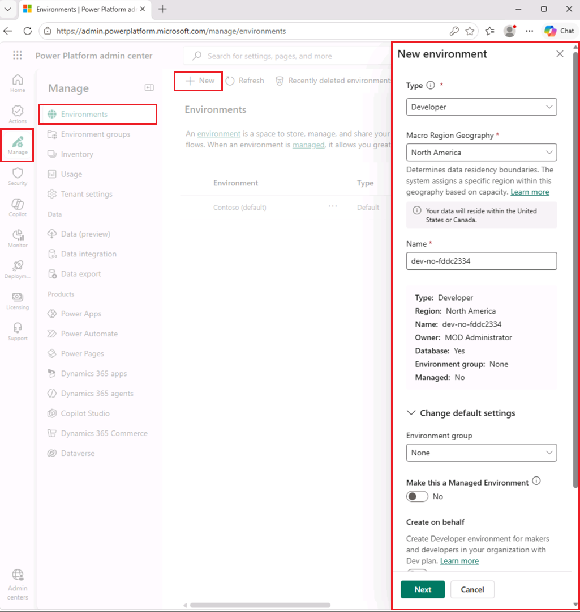

---
lab:
  title: Copilot Studio Lab Setup
  description: In this exercise, you will access the Microsoft Copilot Studio portal and create an environment to use throughout the remaining labs.
  duration: 10 minutes
  level: 200
  islab: true
  primarytopics:
    - Microsoft 365
    - Microsoft Copilot Studio
---

# Create a Power Platform environment

## Power Platform Admin Center

Before you start the lab exercises, you must create a development environment to work in.

1. Open a web browser, navigate to `https://admin.powerplatform.microsoft.com/manage/environments`, and sign in using your credentials for this exercise.

1. If prompted, choose the option to stay signed in.

1. Close any pop-up messages that are displayed.

### Add Dataverse to the default environment

1. Select the ellipses (**...**) for the **Contoso (default)** environment and select **Add Dataverse**.

   

1. Leave all of the default settings and select **Add**.

### Create a new environment

1. In the **Environments** page, select **+ New** to create a new environment with the following settings:

   - **Type**: Developer
   - **Macro Region Geography**: North America
   - **Name**: *Your name*
   
   

1. Expand **Change default settings** and configure the following:
   - **Environment group**: None
   - **Make this a Managed Environment**: No
   - **Get new features early**: No
   - **Create on behalf**: No
   - **Add a Dataverse data store?**: Yes

1. Select **Next** and in the **Add Dataverse** section:

   - **Language**: English (United States)
   - **Currency**: USD ($)
   - **Deploy sample apps and data**: No

1. Select **Save** and wait until the state of your environment is **Ready** (you can use the **Refresh** button to update the display).

   > [!NOTE]
   > Environment provisioning can take several minutes depending on tenant configuration.

   

1. In a new browser tab, navigate to `https://copilotstudio.microsoft.com/` and sign in if prompted.

1. If Copilot Studio opens in the new experience, locate the **New experience** toggle in the upper-right corner of the page and turn it off to return to the classic experience. On the **Submit feedback to Microsoft** dialog, select **Submit** > **Done** to close it. If Copilot Studio opens in the classic experience, skip this step.

   > [!NOTE]  
   > If you experience issues loading Copilot Studio on your environment:
   > - First, capture your environment ID (GUID) from the Power Platform admin center:
   >   1. Open the environment you created at `https://admin.powerplatform.microsoft.com/manage/environments`.
   >   2. Locate the environment ID in the URL (a long string such as `12345678-90ab-cdef-1234-567890abcdef`).
   >   3. Copy and save this value.
   > - Then try accessing your environment directly by pasting your ID into the following URL:
   >   ```
   >   https://copilotstudio.microsoft.com/environments/<your-environment-id>/home
   >   ```

1. If prompted, select **Get Started** and keep the default country or region settings.

1. Skip any welcome messages that appear.

1. In the upper right corner of the page, switch environments by using the Environment Selector and select the environment you created.

   

You now have a Power Platform environment to work in.
